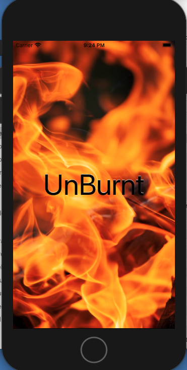
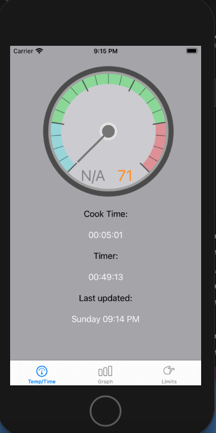
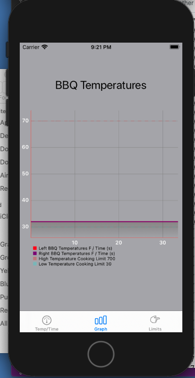
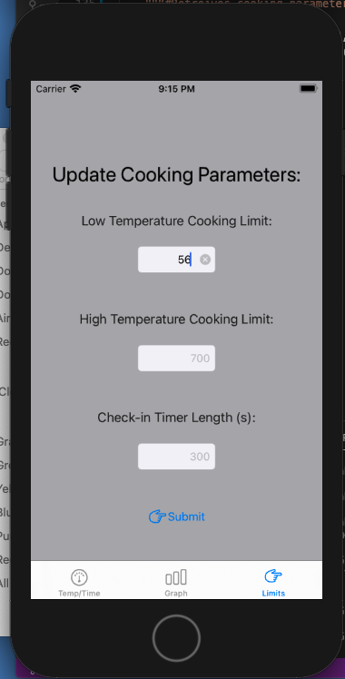

# UnBurntApp
("TryAlamoFirePost")
Still a work in progress

Testing done through TestFlight and using Xcode simulator

Before launching, have UnBurntAPI.py and UnBurnt.py running, all .json files set up and arduino Nano with sensors attached (at this state 2 thermocouples and 1 flame sensor) running (see UnBurnt and UnBurntAruduino GitHub repositories) 

Next steps:
- change colour of text (for temperature readings) on guageView in SecondViewController with in range of cooking state only (not between states) ie too hot/ too cold
- fix notification actions and have them stored / sent to UnBurnt.py
- fix UI to better adapt for various sizes 
- change original file structure so no longer named "TryAlamoFirePost"
- swap names of Second and First View controllers as they appear in opposite order

